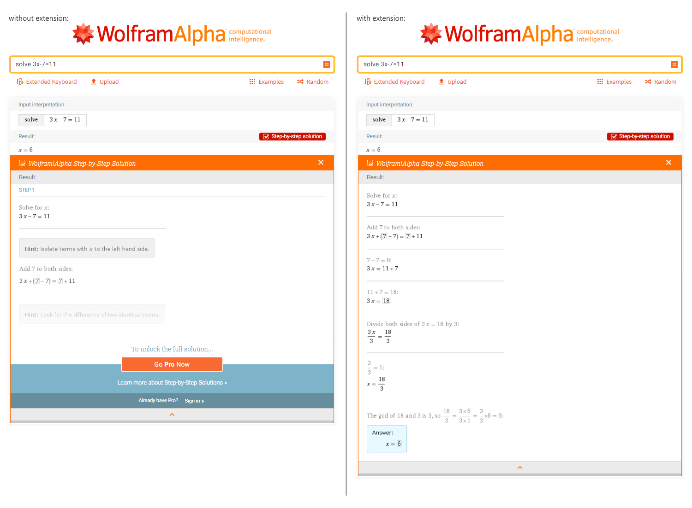

# wolframalpha-moresteps

Browser extension that automatically replaces partial step-by-step solutions on Wolfram|Alpha with complete solutions from the API

## Setup

To use this extension, you'll need an AppID for the Wolfram|Alpha API. If you don't have a developer account and/or AppID yet, follow these steps to get one:

1. Create a Wolfram ID here [https://developer.wolframalpha.com/portal/myapps/](https://developer.wolframalpha.com/portal/myapps/), and confirm your email address
2. Sign up for API access in the developer portal
3. Create a new application and copy the AppID

Once you've obtained an AppID, click the extension icon, paste the AppID and click `'Save'`.

## Screenshot

## Development

Requirements:
- OS: Windows, Linux, macOS
- Node.js: ≥ 10.x

Steps:
1. Clone this repository
2. Run `npm install && npm run build <browser>`, where `<browser>` is either `chrome` or `firefox`
3. Install the extension
    - Chrome
        1. Go to `chrome://extensions`, enable developer mode
        2. Click `'Load unpacked'` and select the `dist/` directory
    - Firefox
        1. Go to `about:debugging#/runtime/this-firefox`
        2. Click `'Load Temporary Add-on...'` and select the `dist/manifest.json` file
